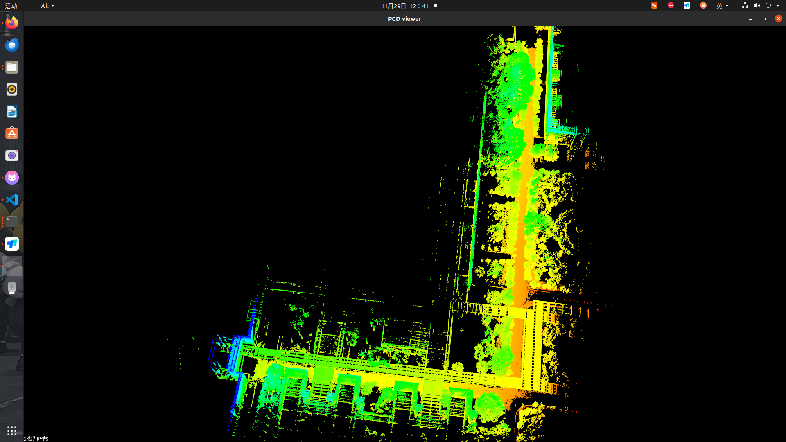

# 人工智能开源软件开发与管理课程项目报告

## 1. 论文公式对应代码

---

## 2. 项目简介
本项目基于 FAST-LIO 开源软件，旨在改进其在不同类型 LiDAR（包括 Livox、Velodyne）的适配与性能表现，并在无人机平台上进行实际测试与验证。

---

## 3. 问题提出
在原有 FAST-LIO 系统中遇到的问题：
1. 对不同类型 LiDAR（尤其是固态 Livox）支持有限，需要额外适配。
2. 在复杂环境下存在退化现象，影响定位精度。
3. 在嵌入式平台（例如 Raspberry Pi 4B）上运行时存在性能瓶颈。

---

## 4. 创新点与改进方法
1. **创新点一**：优化 ikd-Tree 数据结构，提升点云匹配速度。
2. **创新点二**：增加多传感器数据融合功能（外部 IMU + LiDAR）。
3. **创新点三**：在 ARM 平台上进行针对性性能优化，提升嵌入式部署可行性。

---

## 5. 方法流程
flowchart TD
    A[LiDAR 数据采集] --> B[IMU 数据同步]
    B --> C[点云去畸变]
    C --> D[ikd-Tree 增量建图]
    D --> E[迭代扩展卡尔曼滤波]
    E --> F[里程计输出与地图更新]

---

## 6. 实验环境
硬件：Jetson Orin Nano（8GB）、Livox Mid-360、外接 SSD
软件：Ubuntu 20.04 + ROS Noetic + FAST-LIO
测试场景：广东工业大学工创楼直到广东工业大学教学区东门

---

## 7. 实验结果
